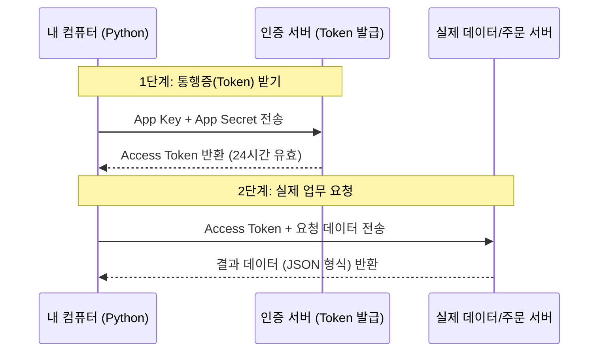

# Task 1-1: 키움증권(한투 KIS) REST API 연결 개념 정리

이미 모의투자용 API 키를 발급받으셨으므로, 이제 이 키를 어떻게 사용하여 서버에 연결하는지 **핵심 개념과 연결 흐름**을 중심으로 설명해 드립니다.

## 1. 연결의 핵심: "헤더(Header)가 전부다"
REST API 연결에서 가장 중요한 포인트는 HTTP 요청의 **헤더(Header)** 정보를 정확히 구성하는 것입니다. 서버는 헤더를 보고 "누가", "어떤 서비스에", "어떤 권한으로" 접근하는지 판단합니다.

### 주요 헤더 항목
- `Content-Type`: 보통 `application/json`을 사용합니다.
- `appkey`: 발급받으신 App Key입니다. (아이디 역할)
- `appsecret`: 발급받으신 App Secret입니다. (비밀번호 역할)

### 💡 왜 키가 두 개(App Key, Secret)나 필요한가요?
쉽게 비유하자면 **"로그인 ID"와 "비밀번호"**의 관계라고 보시면 됩니다.

1.  **App Key (아이디)**: "어떤 앱이 접근하는지" 식별하기 위한 이름입니다. 비유하자면 명함이나 ID 카드 같은 것으로, 상대적으로 덜 위험합니다.
2.  **App Secret (비밀번호)**: "그 앱이 정말 본인이 맞는지" 증명하기 위한 비밀 값입니다. 절대 타인에게 노출되어서는 안 됩니다.

**보안상 이유**: 만약 키가 하나뿐이라면, 그 키 하나만 노출되어도 내 계좌가 털릴 수 있습니다. 하지만 시스템은 두 값을 조합해서 복잡한 '암호화 서명'을 만들거나, 토큰을 발급할 때 검증하는 용도로 사용하므로 보안성이 훨씬 높아집니다.

### 🔗 Git SSH와의 차이점 (트랜잭션 관점)
Git의 SSH 방식과 증권 API 방식은 "안전하게 상태를 변경(Transaction)한다"는 본질은 같지만, 방식의 차이가 있습니다.

| 구분 | Git (SSH) | 증권 API (App Key/Secret) |
| :--- | :--- | :--- |
| **방식** | **비대칭키**: 내 컴퓨터에 비밀키 보관 | **대칭키(공유 비밀)**: 비밀번호를 서버와 공유 |
| **인증** | 내 비밀키로 서명 (키가 안 나감) | 비밀번호(Secret)를 보내서 확인 |
| **권한** | 한 번 연결되면 지속됨 | **토큰**을 통해 유효 기간/권한 조절 |
| **표준** | 서버 관리/Git 전용 | 전 세계 웹 API 표준 (REST/OAuth2) |

> **안과장의 한마디**: Git은 "내 컴퓨터 안에 열쇠를 숨겨두는 방식"이라면, 증권 API는 "안전한 통로(HTTPS)를 통해 매번 비밀번호를 확인받고 통행증을 받는 방식"입니다.

## 2. API 연결의 2단계 흐름

### 1단계: 접근 토큰(Access Token) 발급
- **개념**: 서버에 "나는 정식 사용자다"라는 것을 증명하고 24시간 동안 쓸 수 있는 '일일 통행증'을 받는 과정입니다.
- **방식**: `oauth2/tokenP` 엔드포인트에 `POST` 요청을 보냅니다.

### 2단계: 서비스 호출 (주식 조회/주문 등)
- **개념**: 통행증(Token)을 지참하고 실제 데이터를 달라고 요청하는 과정입니다.
- **방식**: 각 서비스 엔드포인트에 맞게 요청을 보내며, 이때 헤더에 아까 받은 토큰을 반드시 포함해야 합니다.

## 3. 모의투자(Sandbox) 환경의 특징
- **안전성**: 실제 돈이 나가지 않으므로 마음껏 테스트할 수 있습니다.
- **도메인**: 실제 서버와 물리적으로 분리되어 있어 접속 주소가 다릅니다 (`openapivts...`).
- **제한**: 일부 데이터 제공 주기가 실전보다 늦거나, 특정 종목만 조회 가능할 수 있습니다.

## 4. 보안 주의사항 (.env 사용 이유)
`App Secret`은 비밀번호와 같습니다. 코드 안에 직접 적어두면 GitHub 등에 올릴 때 유출될 위험이 큽니다. 따라서 별도의 `.env` 환경 변수 파일에 저장하고, 파이썬 코드에서는 `python-dotenv` 같은 라이브러리로 읽어오는 것이 업계 표준입니다.

---
> [!NOTE]
> 이제 연결 개념은 파악하셨을 겁니다. 다음 단계(Task 1-2)에서는 이 개념을 사용하여 실제로 코드로 토큰을 발급받는 `kiwoom_rest_auth.py` 파일을 만들어 보겠습니다. 준비되셨나요?
